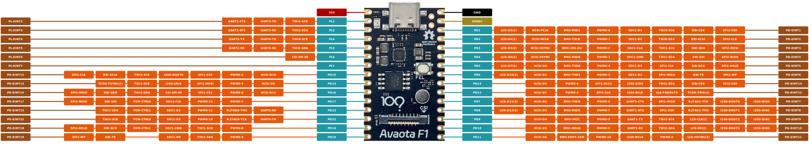

# AvaotaF1 V821 Core DevKit

The **AvaotaF1 V821 Development Kit** adopts a Pico-size design, compact yet powerful. It supports a standard 2.54mm pitch header interface, making it easy to connect to a breadboard for DIY experiments. Its ultra-thin double-sided design makes it the size of a 1-yuan coin, integrating all the core features of the V821, greatly enhancing development flexibility and scalability.

This development kit boasts several powerful features:

- **Onboard MIPI CSI camera interface** for high-definition image capture.
- **MIC pickup function** for easy audio acquisition.
- **SPI NOR FLASH (32MB)** for ample storage space.
- **Wi-Fi ceramic antenna** supporting wireless connectivity and network
 expansion.
- **TF card socket** for easy data storage and expansion.
- **Burn button** for simplified firmware burning.
- Abundant **GPIO resources** that can be flexibly configured to control external hardware devices.

The development kit supports the latest **Tina Linux 5.0 system**, enabling direct development on the V821 AvaotaF1. It also supports various accessories:

- **MIPI Camera GC2083** for high-quality image capture.
- **SPI screens**: including 3.5-inch 320x480 resolution display and 1.54-inch 240x240 resolution display to meet various display needs.

The AvaotaF1 V821 development kit integrates a wealth of features, is easy to operate, and is convenient for expansion, making it an ideal choice for embedded development and experiments.

## Development Board Specifications

| Item       | Specification                                      |
|------------|----------------------------------------------------|
| Main Chip  | Allwinner V821L2-WXX                               |
| PMU        | Integrated power management chip EA3036            |
| DDR        | Internal 64MB DDR2                                 |
| Memory     | NOR Flash 32MB (PY25Q256)                          |
| Wireless   | SIP 2.4GHz Wi-Fi                                   |
| Camera     | Monocular 1920x1080@30fps                          |
| Display    | 3.5-inch (320x480) SPI screen                      |
| Microphone | Analog microphone x1                                |
| Button     | FEL burn button                                    |
| LED        | LED x1                                             |
| Debug      | Supports UART serial debugging, ADB USB debugging |
| USB        | Type-C USB x1, supports power, data transfer, and serial output |
| GPIO       | Dual 30Pin header, supports up to 28 GPIO signals   |
| Board Size | Length: 35mm, Width: 22mm                           |
| Layers     | 6-layer board                                       |

## Development Board Interface Function Diagram

## Pinout

